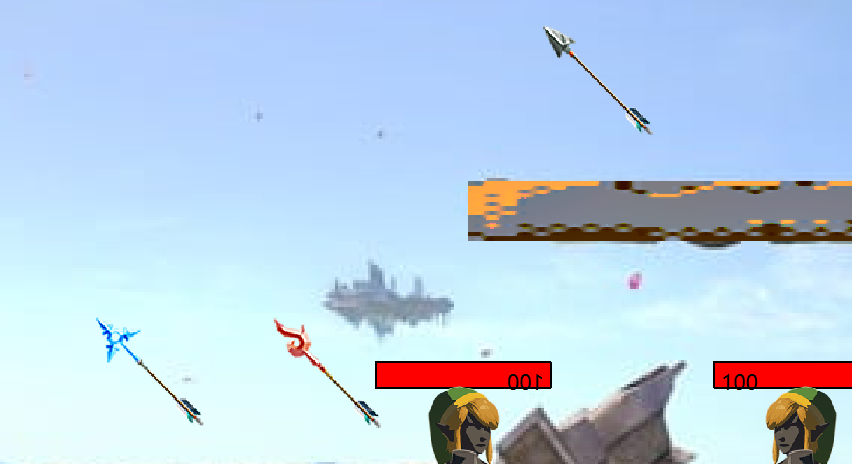

## 说明文档

王展鹏 软件03 2020010876

## 一、实验环境
- 操作系统：Windows 11
- Qt：6.5.2 (MinGW 11.2.0 64-bit)
- Cmake：3.29
- VSCode：1.93.0

## 二、运行方法

进入 `bin/` 目录, 运行 `qt_programming_2024.exe` 

## 三、项目说明
### 1. 项目结构
```shell
qt_programming_2024
├── assets : 资源文件
└── src : 源代码
    ├── main : 主程序入口
    ├── MyGame : 游戏窗口程序入口
    ├── Scenes : 游戏主要场景类
    └── Items : 游戏物品类
        ├── Item : 物品基类
        ├── Mountable : 可装备接口
        ├── Physical : 物理效果接口
        ├── Elemental : 元素效果接口
        │
        ├── Characters : 角色类
        ├── HeadEquipments : 头部装备类
        ├── Armors : 上身装备类
        ├── LegEquipments : 腿部装备类
        │
        ├── Arrows : 箭类
        ├── Bows : 弓类
        ├── MeleeWeapons : 近战武器类
        │   ├── LongSwords : 长剑类
        │   ├── Spears : 矛类
        │   └── Swords : 剑类
        │
        └── Maps : 地形类
            ├── Map : 地形基类
            ├── Battlefield : 战场基础地形
            └── Platform : 平台地形
```

### 2. 模块关系
1. 抽象基类
    - Scene : 游戏场景，包含游戏中的所有图像和物品的交互逻辑
    - Item : 游戏物品，是所有可交互物品的基类
2. 功能接口类
    - Mountable : 可装备接口，用于装备物品到角色身上
    - Physical : 物理效果接口，用于处理人物、装备、武器的加速度、速度、位置等物理效果
    - Elemental : 元素效果接口，包括材质、元素、元素免疫等功能
3. 具体类
    - Characters : 角色类，继承自 Item，实现了 Physical 和 Elemental 接口
    - HeadEquipments : 头部装备类，继承自 Item，实现了 Mountable 、Physical 和 Elemental 接口
    - Armors : 上身装备类，继承自 Item，实现了 Mountable 、Physical 和 Elemental 接口
    - LegEquipments : 腿部装备类，继承自 Item，实现了 Mountable 、Physical 和 Elemental 接口
    - Arrows : 箭类，继承自 Item，实现了 Physical 和 Elemental 接口
    - Bows : 弓类，继承自 Item，实现了 Physical 和 Elemental 接口
    - MeleeWeapons : 近战武器类，继承自 Item，实现了 Physical 和 Elemental 接口
        - LongSwords : 长剑类，继承自 MeleeWeapons
        - Spears : 矛类，继承自 MeleeWeapons
        - Swords : 剑类，继承自 MeleeWeapons
    - Maps : 地形类，继承自 Item，实现了 Elemental 接口

### 3. 运行流程
1. `main` 函数中创建 `MyGame` 对象，显示游戏窗口
2. `MyGame` 对象创建 `Scene` 的派生类对象 `BattleScene`，显示游戏对战场景，进入游戏循环
3. `BattleScene` 对象创建角色、装备、武器、地形等物品，初始化游戏场景
4. 游戏循环中，用户可以通过键盘控制角色移动、攻击、装备等操作
5. `BattleScene` 对象在每一帧中更新游戏物品的状态，包括物理位置、生命值、动画等
6. 游戏循环中，`BattleScene` 检测角色生命值，如果其中一个角色生命值为 0，则游戏结束，显示游戏结果

## 四、功能实现

### 基本移动和生命值
- 左右移动、跳跃、重力加速度。
- 
- 两个玩家同屏对战。
- 

### 多种地形
- 不同平台，不同材质。
- 

### 生命值系统
- 每个玩家各有一定的生命值，支持显示生命值。
- 
- 受到伤害会减少生命值。
- 
- 游戏结束判定。
- 

### 物品掉落
- 武器物品随机下落。
- 
- 捡起物品。
- 
- 作弊码输入生成任意指定物体。
- 

### 近战武器
- 渲染武器，使用按键进行攻击。有攻击动画。
- 
- 近战武器有多重类型：
  - 单手剑：朝角色面向方向进行攻击。
  - 
  - 矛：朝角色面向方向进行攻击，攻击距离更长。
  - 
  - 双手剑：同时朝角色面向和背向的方向进行攻击。
  - 
- 近战武器有两种材质：金属质和木质。
- 

### 弓和箭
- 天空中会掉落箭，使用按键4捡起箭。
- 
- 支持至少三种不同的弓，每个弓有不同射程，一次能射出的箭的数量不同。
- 
- 弓有两种材质：金属质和木质。
- 

### 多种盔甲
- 盔甲分为头部、上身和下身三部分。设计三种盔甲，分别提供对火、冰、电的免疫效果。
- 

## 五、参考文献

1. [Qt Documentation](https://doc.qt.io/qt-6/)
2. [薩爾達傳說 Wiki](https://zelda.fandom.com/zh-tw/wiki/%E6%B5%B7%E6%8B%89%E9%AD%AF%E5%9C%96%E9%91%91#%E6%AD%A6%E5%99%A8)